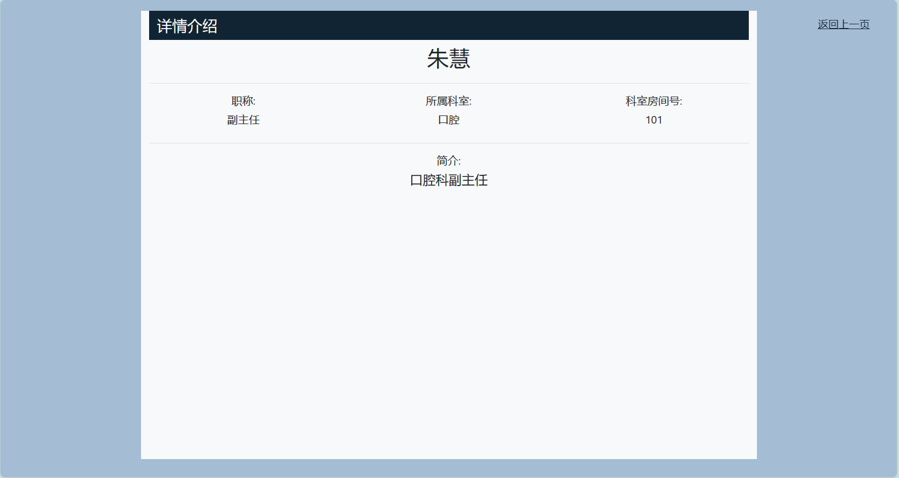
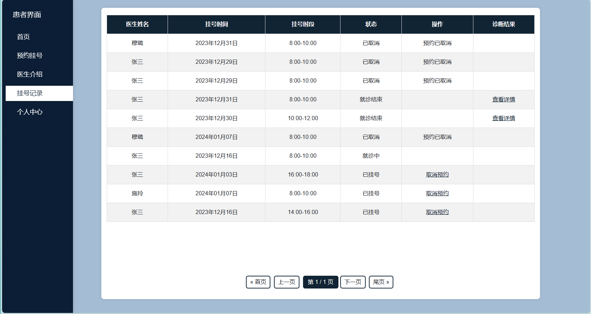
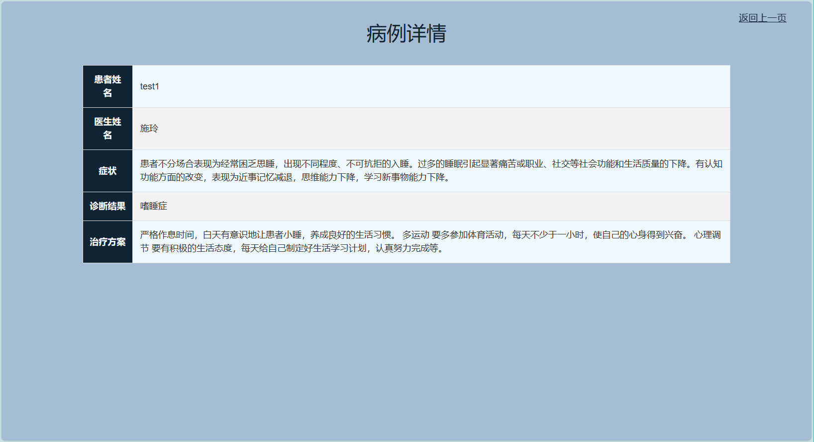
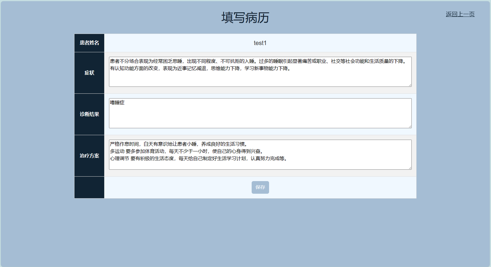
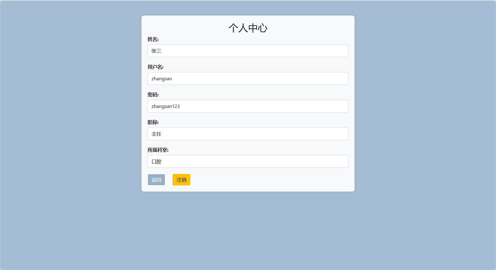

### 功能演示  
#### 患者  
* ##### 预约挂号:  
* - 可以通过医生姓名或者科室来筛选医生, 点击对应医生的预约按钮进入预约界面  
  
* - 选择日期和时段后提交预约  
  
* ##### 医生介绍:  
* - 按科室展示所有医生, 点击医生的名字可以进入医生详情界面  
  
* - 医生详情界面可以看到医生的职称, 科室, 科室房间号, 以及简介信息  
  
* ##### 挂号记录:
* - 可以看到已经预约的挂号记录, 当医生未开始接诊时(状态为已挂号), 可以点击取消预约来取消.  
  
* - 当医生填写好病例, 并结束就诊后, 可以点击查看详情来查看诊断结果  
  
* 个人中心:  
* - 可以看到患者的个人信息, 可进行注销账号操作  
  

#### 医生  
* ##### 患者预约记录:  
* - 按照预约时间, 预约时段顺序对患者预约记录排序  
  
* - 点击接诊后可以填写病例, 结束就诊  
  
* ##### 药房:  
* - 可以根据药物名或药物类型来筛选药物:  
  
* ##### 个人中心:  
* - 可以看到医生的个人信息, 可进行账号注销操作:  
  

