### OpenGauss数据库配置  
#### 环境:  
Oracle VM VirtualBOX  
CentOS Linux release 7.9.2009 (Core)  
gaussdb (openGauss 5.1.0)  
Django 3.0.0  
Windows下连接本地虚拟机数据库端口进行开发  

#### 虚拟机网络配置  
启用两个虚拟机网卡, 一个设置为 仅主机(Host-Only)网络, 另一个设置为 网络地址转换(NAT), 在虚拟机执行  
```
ifconfig
```
找到类似 `192.168.56.10x`的ip地址:  
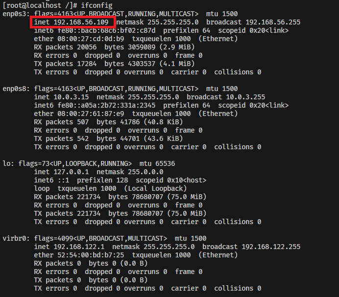  
查看是否能够从主机ping通虚拟机  

#### openGauss部署:  
1. 首先按照安装教程安装数据库: [极简版安装](https://docs-opengauss.osinfra.cn/zh/docs/5.1.0/docs/InstallationGuide/%E6%9E%81%E7%AE%80%E7%89%88%E5%AE%89%E8%A3%85.html). (需要创建一个操作系统的普通用户: omm, 数据库操作都在普通用户下进行)  
2. 数据库连接配置, 在`/opt/opengauss/data/single_node/postgresql.conf`配置中, 修改以下值(可能需要root权限)  
    ```bash
    listen_addresses = '*'  # 监听本地所有地址  
    port = 26000            # 数据库服务的端口号, 自行设置  
    ```
3. 数据库的配置  
    数据库的初始化, 启动与连接  
    ```bash
    # 初始化数据库
    gs_initdb -D /opt/opengauss/data/single_node -w "Gauss@123" --nodename='data'  
    # 启动数据库  
    gs_ctl start -D /opt/openGauss/data/single_node/ -Z single_node  
    # 连接数据库, -p 后为第二部设置的port值
    gsql -d postgres -p 26000 -r  
    ```
    数据库中的用户
    ```sql
    # 创建数据库用户(连接数据库后执行指令, 注意分号)
    CREATE USER omm WITH PASSWORD "Gauss@123";
    # 创建数据库, 属于omm用户
    CREATE DATABASE db_project OWNER omm;
    # 再创建一个非数据库持有者用户admin, 后续Django连接数据库的用户不能是数据库的持有者
    CREATE USER admin WITH PASSWORD "Gauss@123";
    # 授予admin所有权限
    GRANT ALL PRIVILEGES ON db_project TO admin;
    ```
    ```bash
    # 以admin身份连接数据库, Django都是以admin进行操作, 只有admin能看到  
    gsql -d db_project -r -p 26000 -U admin
    ```
#### 遇到的问题:  
1. 执行以下启动时, 数据库启动失败, 显示`permission denied`
    ```bash
    gs_ctl restart -D /opt/software/openGauss/data/single_node -Z
    single_node -l logfile
    ```
    由于普通用户的权限问题, 可能无法写日志文件logfile, 去掉`-l logfile`后能够正常启动.  
2. 使用vscode的ssh连接虚拟机进行环境配置时, 直接打开了根目录文件夹`/`(便于查找文件), 由于虚拟机只分配了4G内存, 查看内存占用时发现占了3G, 没有有足够的内存来启动数据库, 而且执行清理内存指令无法清除.  
断开vscode的连接后使用命令行的ssh直接连接, 发现内存占用正常, 能够正常启动数据库(当初因为这个重新还配置了一遍环境QAQ).  
推荐完成环境配置后使用命令行的ssh进行连接虚拟机来启动数据库(或者直接使用虚拟机启动).  

#### Django 配置  
安装Django 3.0.0  
```
pip install Django==3.0.0
```
基本操作  
```bash
#初始化项目
django-admin startproject 项目名称
#创建应用
python manage.py startapp 应用名称
#运行服务器
python manage.py runserver
#生成迁移文件
python manage.py makemigrations
#执行sql语句生成数据表
python manage.py migrate
```
在创建完成项目与应用后, 每次修改`models.py`都要执行生成迁移文件和生成数据表  
```bash
python manage.py makemigrations
python manage.py migrate
```
Django数据库与openGauss进行连接, 修改项目中`settings.py`文件中的数据库配置:  
```py
DATABASES = {
    'default': {
        # 'ENGINE': 'django.db.backends.sqlite3',
        'ENGINE': 'django.db.backends.postgresql_psycopg2',
        'NAME': 'db_project', #数据库名
        'USER': 'admin', #用户名
        'PASSWORD': 'Gauss@123', #密码
        'HOST': '192.168.56.109',#虚拟机ip
        'PORT': 26000 #openGauss数据口的端口
    }
}
```


### 功能演示  
#### 患者  
* ##### 预约挂号:  
* - 可以通过医生姓名或者科室来筛选医生(支持模糊搜索), 点击对应医生的预约按钮进入预约界面  
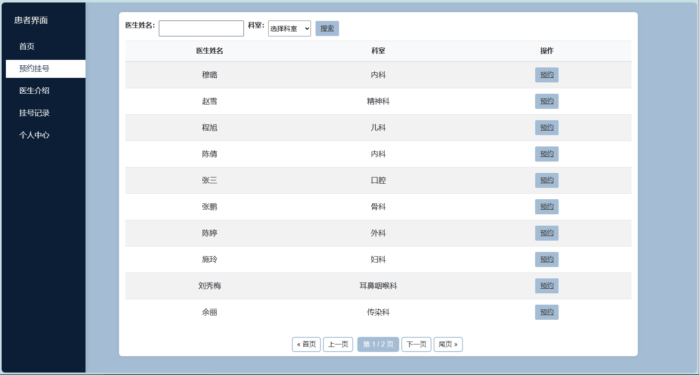  
* - 选择日期和时段后提交预约  
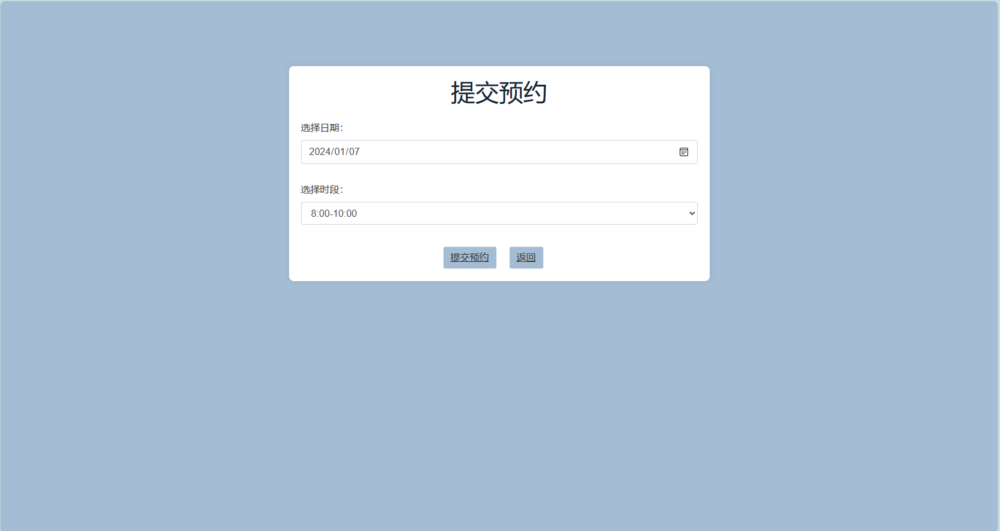  
* ##### 医生介绍:  
* - 按科室展示所有医生, 点击医生的名字可以进入医生详情界面  
  
* - 医生详情界面可以看到医生的职称, 科室, 科室房间号, 以及简介信息  
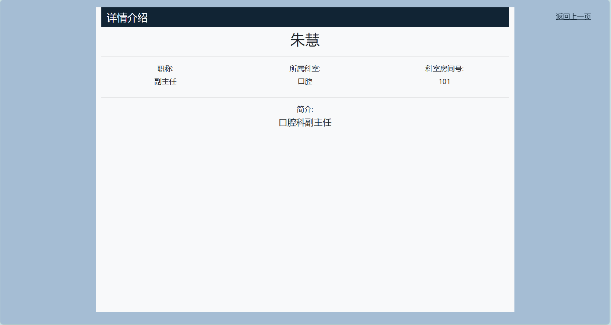  
* ##### 挂号记录:
* - 可以看到已经预约的挂号记录, 当医生未开始接诊时(状态为已挂号), 可以点击取消预约来取消.  
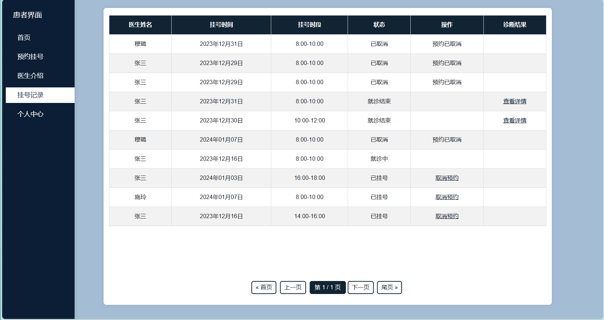  
* - 当医生填写好病例, 并结束就诊后, 可以点击查看详情来查看诊断结果  
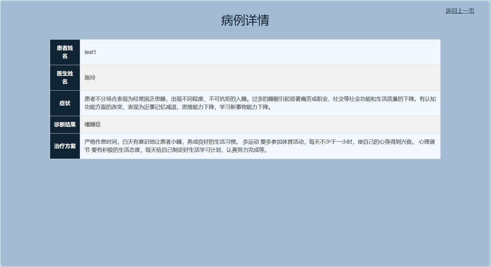  
* 个人中心:  
* - 可以看到患者的个人信息, 可进行注销账号操作  
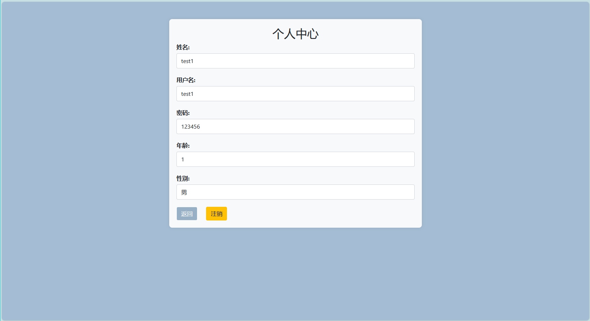  


#### 医生  
* ##### 患者预约记录:  
* - 按照预约时间, 预约时段顺序对患者预约记录排序  
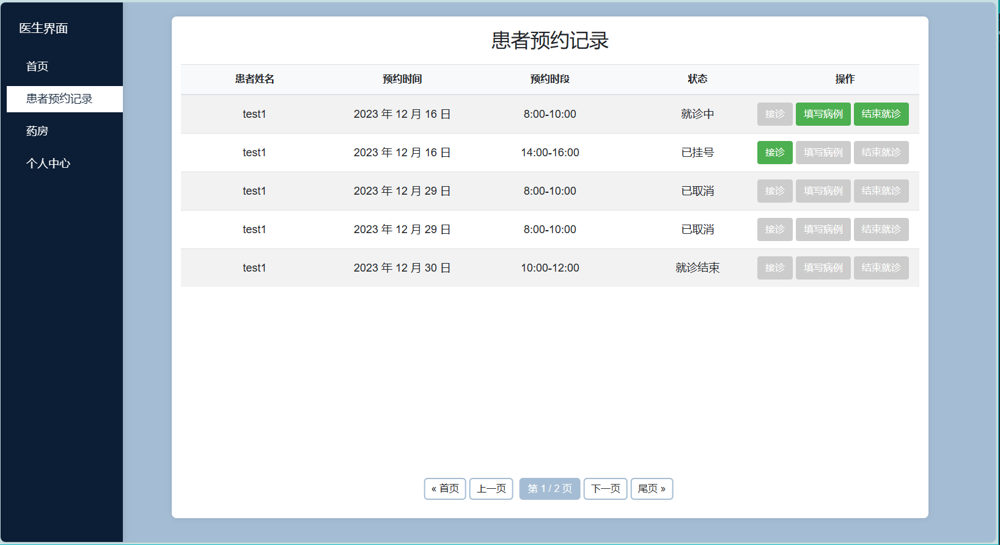  
* - 点击接诊后可以填写病例, 结束就诊  
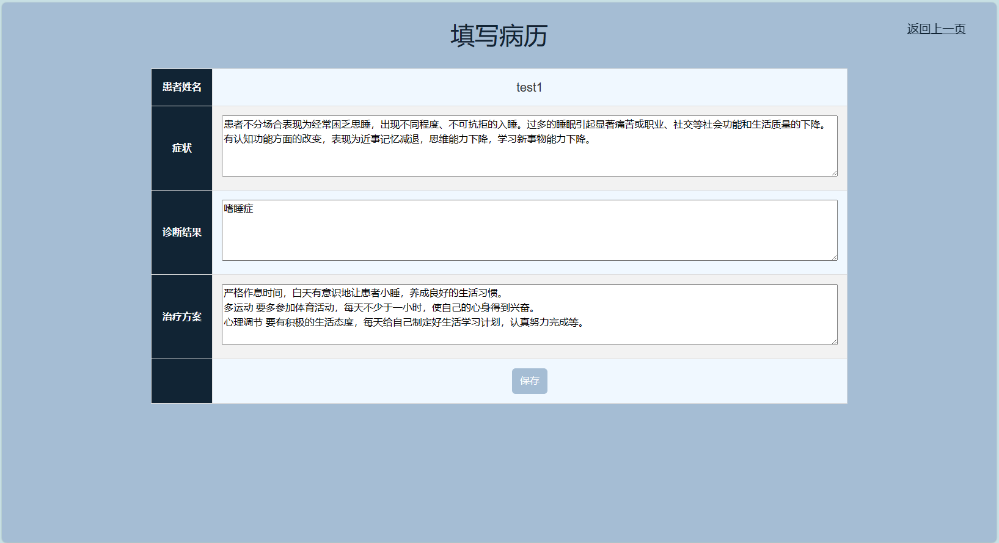  
* ##### 药房:  
* - 可以根据药物名(支持模糊搜索)或药物类型来筛选药物:  
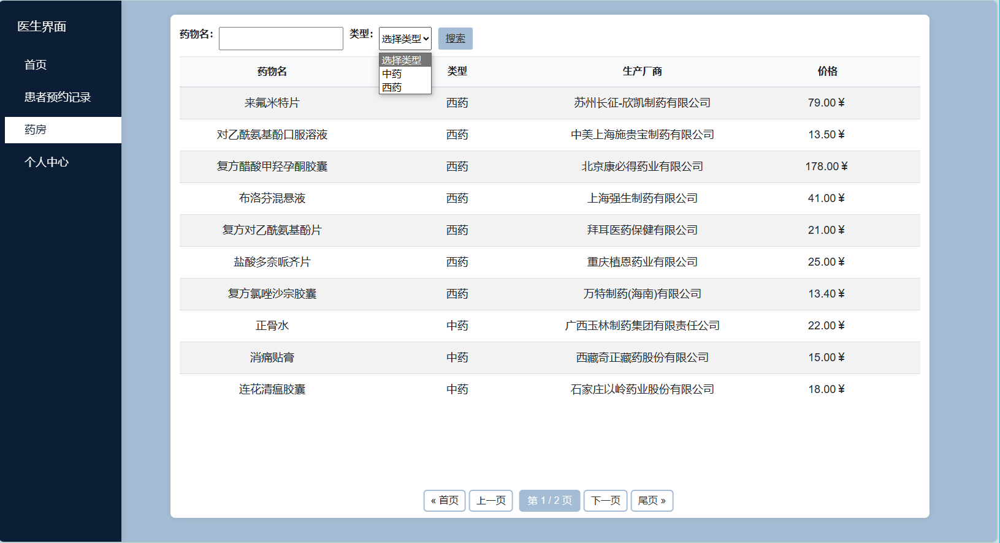  
* ##### 个人中心:  
* - 可以看到医生的个人信息, 可进行账号注销操作:  
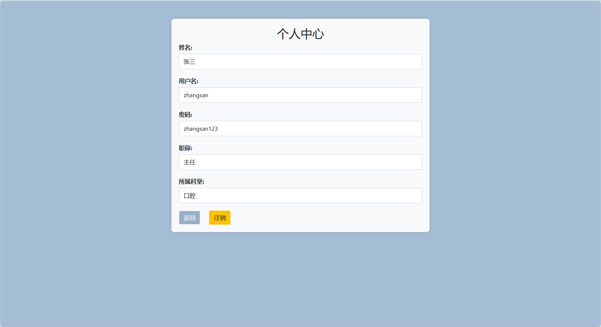  